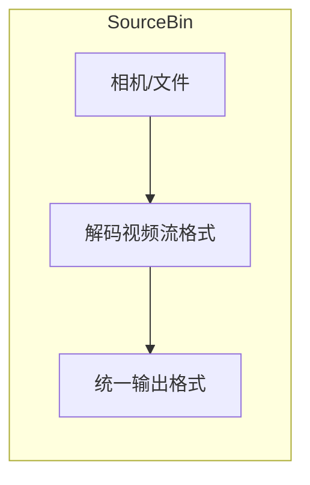

# 一、DEMO实现

接下来自己手写一个管线，实现：
```text
source
   |
   v
  tee
   |
   +--> queue -> videoconvert BGR -> appsink(algo.py)
   |
   +--> queue -> mpph264enc -> filesink -> output.mp4
   |
   +--> queue -> filesink 544x408@10fps -> mpph264enc MJPEG -> appsink(web.py)

```

大致设想是这样的，但是我分析了一下我们常用的调试场景，输入的源可能是

 - linux 跑存图
 - windows 跑存图
 - linux 相机

gst麻烦就麻烦在这里，不能像opencv直接读

所以第一项工作是先封装一下输入源

# 二、Sourcebin

上一篇日志介绍了element元素，他像一截管道，有输入和输出。不过稍微有点违反直觉的是，输入的接口（pad）叫sink，输出的接口叫src


gst中提供一种叫bin的容器，他可以封装element元素，然后对外暴露接口，变成一个元素

同理，后面我们封装支路时也需要大量运用bin容器。


测试脚本
```bash
cd /root/Program/rkvision/
python3 gst_test.py 
```

我的想法是把所有的支路封装起来，然后在pipline中给他们链接起来，pipline去动态管理管道。

关于封装的bin，大致结构就是：
 - Gst.ElementFactory.make() 需要的元素
 - set_property()为元素设置参数
 - .link() 链接管道
 - 暴露sink/src接口。

sourcebin的问题在于，使用了uridecodebin这样一个“元素”，这个元素会先检测输入源的类型，再安排工具链进行编码，这会导致他的输出src并不固定。因此需要设置一个回调函数`_on_pad_added_to_conv`去link解析后的管道。所以这一部分看起来比较复杂。

同时，为了调通整个管道，我写了一个显示的bin，这一部分就很清晰了：

```python
class DisplayBin(Gst.Bin):
    """
    用于调试显示: sink ghost -> queue -> videoscale -> capsfilter -> videosink
    """
    def __init__(self, 
                 config: CameraConfig,
                 gst_config: GstConfig,
                 scale_rate: int = 3):
        super().__init__(name="displaybin")
        self.gst_config = gst_config
        self.width = max(1, int(config.width / scale_rate))
        self.height = max(1, int(config.height / scale_rate))
        self._build()

    def _build(self) -> None:
        self.queue = Gst.ElementFactory.make("queue", "queue")
        self.scale = Gst.ElementFactory.make("videoscale", "scale")
        self.cap   = Gst.ElementFactory.make("capsfilter", "cap")
        self.sink  = Gst.ElementFactory.make(self.gst_config.sink, "sink")

        if not all([self.queue, self.scale, self.cap, self.sink]):
            raise RuntimeError("DisplayBin: failed to create elements")

        # 最邻近插值法，减少占用
        self.scale.set_property("method", "nearest-neighbour")
        # 缩小预览图大小, 减少资源占用
        caps_str = "video/x-raw"
        if self.width and self.height:
            caps_str += f",width={self.width},height={self.height}"
        self.cap.set_property("caps", Gst.Caps.from_string(caps_str))

        self.add(self.queue)
        self.add(self.scale)
        self.add(self.cap)
        self.add(self.sink)

        if not self.queue.link(self.scale):
            raise RuntimeError("DisplayBin: queue->scale link failed")
        if not self.scale.link(self.cap):
            raise RuntimeError(f"DisplayBin: scale->cap link failed, {caps_str}")
        if not self.cap.link(self.sink):
            raise RuntimeError("DisplayBin: cap->sink link failed")
        
        # 暴露给外部链接的入口 pad
        ghost_sink = Gst.GhostPad.new("sink", self.queue.get_static_pad("sink"))
        self.add_pad(ghost_sink)
```

别看这部分少，但是也着实调了一天...主要是gst没有librga的库，导致缩放的时候非常耗时，最后添加了一个scale方法才大幅减少了占用，提高了速度。